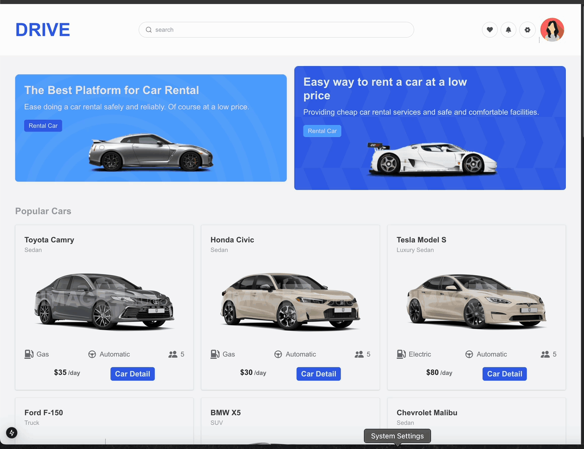

## Car-Rental-Next.js

 

 -I created a car rental website using Next.js to better understand its features. 
 -On the homepage, you can view the details of available cars. 
 -When you click the "Rent a Car" button, you will be redirected to a payment page. If the payment is successful, the car will appear on the "My Orders" page. 
 -For the payment system, I integrated Stripe, and all car data and orders are stored in a MongoDB database. 
 

 <h4>The libraries used </h4>
 ` Next, Millify, Mongoose, Stripe, React-Icons `

`npm run dev`

